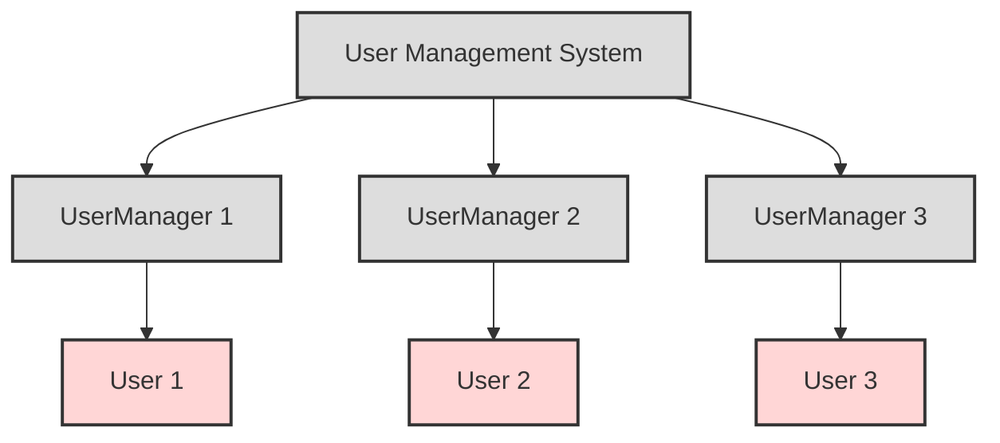
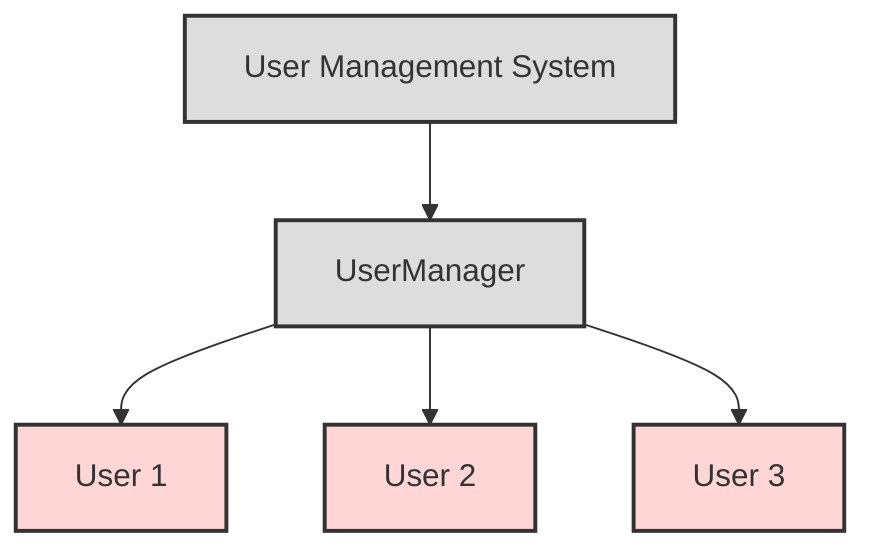
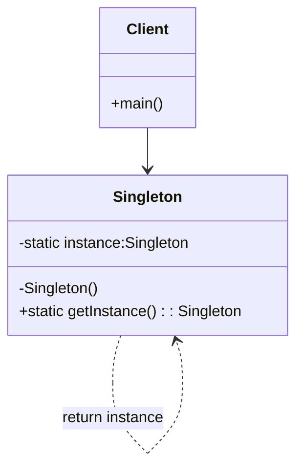

# Singleton

## Introduction

Singleton is a Design Pattern that belongs to the Creational Pattern group. It ensures that only one instance of a class is created throughout the program.

### Problem Statement

In many cases, it is necessary to ensure that only one instance of a class exists. For example, in a user management system, there should only be a single `UserManager` object to manage users.

Creating multiple `UserManager` objects may lead to:

- Duplicate data
- Resource conflicts
- Difficulty in control



### Solution

Singleton solves this problem by ensuring that only one instance is created throughout the entire program.



Explanation:

- The `UserManager` class is implemented as a Singleton.
- There is only ONE `UserManager` object in the system.
- It manages all users centrally.
- It avoids issues such as duplicate data, resource conflicts, and control difficulties.

With this implementation, only one `UserManager` object is created, and this object can be accessed from anywhere in the program.

### Structure

The Singleton Pattern has a simple structure, consisting of the following components:



- Singleton class: This class contains the necessary methods and variables to implement the Singleton Pattern.
- Private constructor: This method can only be called from within the class.
- Private static variable: This variable holds the class instance.
- Public static method to return the class instance: This method returns the class instance.

## Implementation

There are several ways to implement the Singleton Pattern in Java. A common approach is to use a private static variable to store the class instance.

```java
public class Singleton {

    private static Singleton instance;

    private Singleton() {
        // Constructor is private to prevent direct instantiation
    }

    public static Singleton getInstance() {
        if (instance == null) {
            instance = new Singleton();
        }
        return instance;
    }
}
```

This implementation ensures that only one instance of the Singleton is created. When a Singleton object is requested, the `getInstance()` method checks if an instance already exists. If not, it creates a new instance. If it already exists, the method returns the current instance.

Another implementation of the Singleton Pattern uses a private static final variable.

```java
public final class Singleton {

    private static final Singleton instance = new Singleton();

    private Singleton() {
        // Constructor is private to prevent direct instantiation
    }

    public static Singleton getInstance() {
        return instance;
    }
}
```

This implementation is similar to the first one, but it uses a private static final variable instead of a private static variable. This approach has several advantages:

- Using a private static final variable prevents the instance variable from being changed.
- The code structure is more concise.

## Example

Here is an example of how to use the Singleton Pattern to create a `DatabaseConnection` object.

```java
public class DatabaseConnection {

    private static final DatabaseConnection instance = new DatabaseConnection();

    private DatabaseConnection() {
        // Connect to database
    }

    public static DatabaseConnection getInstance() {
        return instance;
    }

    public void query(String sql) {
        // Execute query
    }
}
```

In this example, `DatabaseConnection` is a Singleton class. It has a `getInstance()` method to access the unique instance of the class.

## Comparison

The Singleton Pattern can be compared with some similar Design Patterns, such as:

- Factory Pattern: The Factory Pattern provides a flexible way to create class objects. However, the Factory Pattern does not ensure that only one object of the class is created.
- Prototype Pattern: The Prototype Pattern provides a way to create copies of an object. The Prototype Pattern can also be used to create a single object of the class. However, the Prototype Pattern can be more complex than the Singleton Pattern.

## Notes

When applying the Singleton Pattern, there are a few considerations:

- The Singleton Pattern may reduce the flexibility of an application. For example, if you need to create multiple instances of a class, you would need to modify the code to remove the `getInstance()` method.
- The Singleton Pattern can cause issues during testing. For example, if you are testing a class that uses the Singleton Pattern, you may need to create a mock instance of that class.

## Conclusion

The Singleton Pattern is a useful Design Pattern in cases where it is necessary to ensure that only one instance of a class is created. However, the limitations of the Singleton Pattern should be considered when applying it.

Below are some guidelines for using the Singleton Pattern:

- The Singleton Pattern should be used when it is necessary to ensure that only one instance of a class is created.
- Avoid using the Singleton Pattern when it is not needed.
- Limit the use of Singleton in large or complex systems.