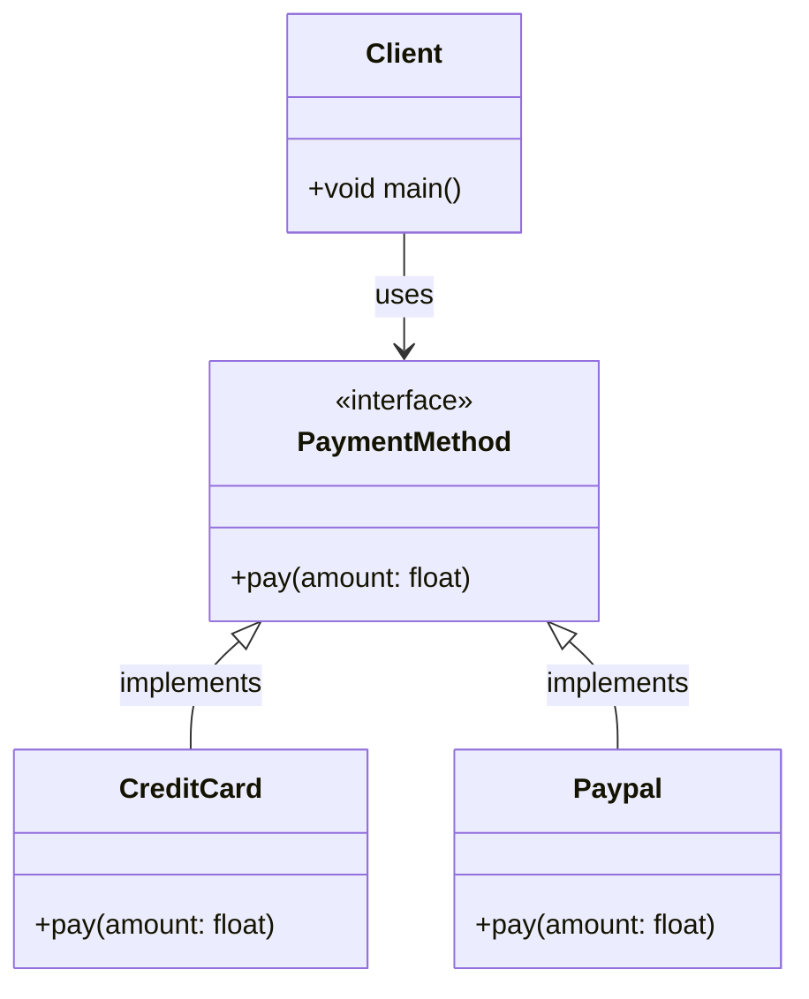
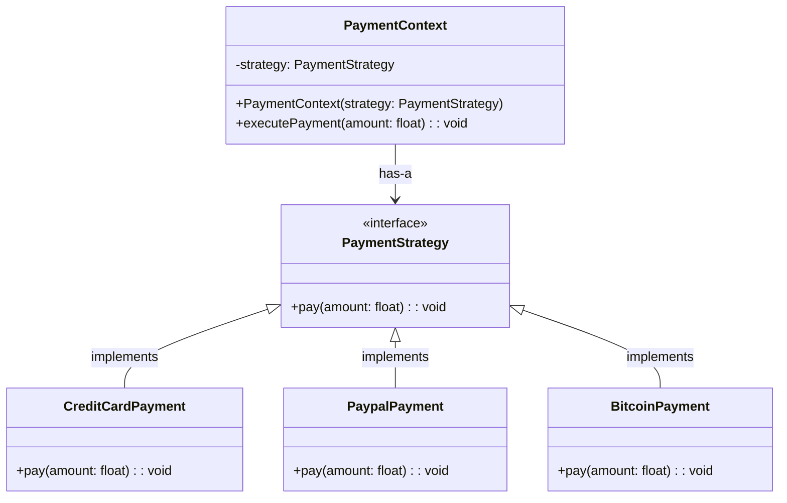
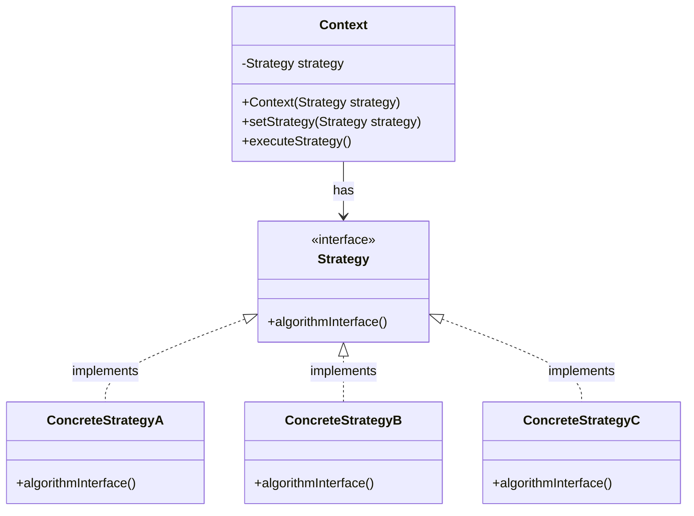

# Strategy Pattern

## Concept

The **Strategy Pattern** is a behavioral design pattern in software development that defines a family of algorithms, encapsulates each one, and makes them interchangeable. Strategy allows the algorithm to vary independently from the clients that use it. This enhances modularity and code reusability by separating the implementation of algorithms from the classes that use them.

### Overview

- **Pattern Definition:** The Strategy Pattern consists of 'Context' (the environment or user of the strategy), 'Strategy' (the specific strategies or algorithms), and a 'Strategy' interface that all concrete strategies implement. The 'Context' holds a reference to a 'Strategy' and communicates with this 'Strategy' object instead of directly implementing a specific algorithm.

- **Purpose:** The purpose of the Strategy Pattern is to provide a way to configure a class with one of many behaviors or change its behavior at runtime. It eliminates the need for conditional statements in the code and replaces them with a strategy object. This makes the code easier to extend and maintain.

- **Core Idea:** The core idea behind the Strategy Pattern is "encapsulating algorithms." By using 'Strategy' objects to represent different algorithms and allowing 'Context' to change its strategy, the application can change its behavior flexibly without affecting the clients. This makes the code more adaptable, easier to understand, and maintainable.

### Problem

In object-oriented programming, applications often face challenges related to selecting appropriate behavior at runtime. A common example is handling different payment methods in an e-commerce system. Without the Strategy Pattern, adding or modifying payment methods can require significant code changes, violating the Open-Closed Principle and increasing complexity and maintenance challenges.



### Solution

The Strategy Pattern solves this problem by defining a family of algorithms, each encapsulated in a separate class with a common interface. This allows the algorithm to change independently of the clients that use it. In the payment system example, different payment strategies like Credit Card, PayPal, or Bitcoin can be implemented as separate classes, making it easy to add or modify payment methods in a flexible way.

Using the Strategy Pattern enhances the modularity and reusability of the code. It reduces the dependencies between classes and increases the flexibility of the application. Additionally, it helps the application comply with the Open-Closed Principle, making it easier to extend without modifying existing code.

Although the Strategy Pattern offers many benefits, using it can come with some trade-offs. For example, it may introduce initial complexity in designing and implementing interfaces and specific classes. Furthermore, managing many strategies can become challenging if there are too many.



## Structure of the Strategy Pattern



- `Context` is the environment class, which holds a reference to a `Strategy` object. The `Context` can change the strategy at runtime.
- `Strategy` is an interface or abstract class defining a group of related algorithms or specific behaviors. In the Strategy Pattern, these algorithms are encapsulated and can be swapped flexibly.
- `ConcreteStrategyA`, `ConcreteStrategyB`, and `ConcreteStrategyC` are the concrete implementations of the `Strategy` interface. Each `ConcreteStrategy` implements a variation of the algorithm or behavior.

The goal of the Strategy Pattern is to allow the algorithm to change independently of the clients that use it.

## How to Implement the Strategy Pattern

To implement the Strategy Pattern, the following components are needed:

### 1. Strategy Interface

This is the interface for different strategies in the context. Each strategy implements specific actions.

```java
public interface Strategy {
    void executeStrategy();
}
```

### 2. Concrete Strategy Classes

These classes implement specific actions for a particular strategy.

```java
public class ConcreteStrategyA implements Strategy {
    @Override
    public void executeStrategy() {
        System.out.println("Executing Strategy A");
    }
}

public class ConcreteStrategyB implements Strategy {
    @Override
    public void executeStrategy() {
        System.out.println("Executing Strategy B");
    }
}
```

### 3. Context

This class maintains a reference to a `Strategy` object and allows the client to change the strategy.

```java
public class Context {
    private Strategy strategy;

    public Context(Strategy strategy) {
        this.strategy = strategy;
    }

    public void setStrategy(Strategy strategy) {
        this.strategy = strategy;
    }

    public void executeStrategy() {
        strategy.executeStrategy();
    }
}
```

### 4. Using the Pattern

Here is how the Strategy Pattern can be used in an application:

```java
public class StrategyPatternDemo {
    public static void main(String[] args) {
        Context context = new Context(new ConcreteStrategyA());

        // The context is using ConcreteStrategyA.
        context.executeStrategy(); // Executing Strategy A

        // Change strategy to ConcreteStrategyB
        context.setStrategy(new ConcreteStrategyB());

        // Now the context is using ConcreteStrategyB.
        context.executeStrategy(); // Executing Strategy B
    }
}
```

## Example

Below is an example illustrating the use of the Strategy Pattern in Java:

```java
import java.util.ArrayList;
import java.util.List;

// Strategy interface
interface PaymentStrategy {
    void pay(int amount);
}

// Concrete Strategies
class CreditCardStrategy implements PaymentStrategy {
    private String name;
    private String cardNumber;

    public CreditCardStrategy(String nm, String ccNum) {
        this.name = nm;
        this.cardNumber = ccNum;
    }

    @Override
    public void pay(int amount) {
        System.out.println(amount + " paid with credit/debit card.");
    }
}

class PaypalStrategy implements PaymentStrategy {
    private String emailId;
    private String password;

    public PaypalStrategy(String email, String pwd) {
        this.emailId = email;
        this.password = pwd;
    }

    @Override
    public void pay(int amount) {
        System.out.println(amount + " paid using Paypal.");
    }
}

// Context class
class ShoppingCart {
    List<Item> items;
    PaymentStrategy paymentStrategy;

    public ShoppingCart() {
        this.items = new ArrayList<>();
    }

    public void addItem(Item item) {
        this.items.add(item);
    }

    public void removeItem(Item item) {
        this.items.remove(item);
    }

    public int calculateTotal() {
        int sum = 0;
        for (Item item : items) {
            sum += item.getPrice();
        }
        return sum;
    }

    public void setPaymentStrategy(PaymentStrategy strategy) {
        this.paymentStrategy = strategy;
    }

    public void checkout() {
        int amount = calculateTotal();
        paymentStrategy.pay(amount);
    }
}

// Item class
class Item {
    private String upcCode;
    private int price;

    public Item(String upc, int cost) {
        this.upcCode = upc;
        this.price = cost;
    }

    public int getPrice() {
        return this.price;
    }
}

// StrategyPatternDemo class
public class StrategyPatternDemo {
    public static void main(String[] args) {
        ShoppingCart cart = new ShoppingCart();

        Item item1 = new Item("1234", 10);
        Item item2 = new Item("5678", 40);

        cart.addItem(item1);
        cart.addItem(item2);

        // Pay by PayPal
        cart.setPaymentStrategy(new PaypalStrategy("myemail@example.com", "mypwd"));
        cart.checkout();

        // Pay by Credit Card
        cart.setPaymentStrategy(new CreditCardStrategy("John Doe", "1234567890123456"));
        cart.checkout();
    }
}
```

In this example, `ShoppingCart` represents the context class, containing a `PaymentStrategy`. The concrete strategies (`CreditCardStrategy`, `PaypalStrategy`) define the different ways to make a payment. The `ShoppingCart` can switch between strategies to use different payment methods without modifying its code.

## When to Use the Strategy Pattern

- **When you want to change an object's behavior at runtime:** The Strategy Pattern is ideal when you need to change an object's behavior at runtime without altering the class structure. Using different strategies makes it easy to switch between